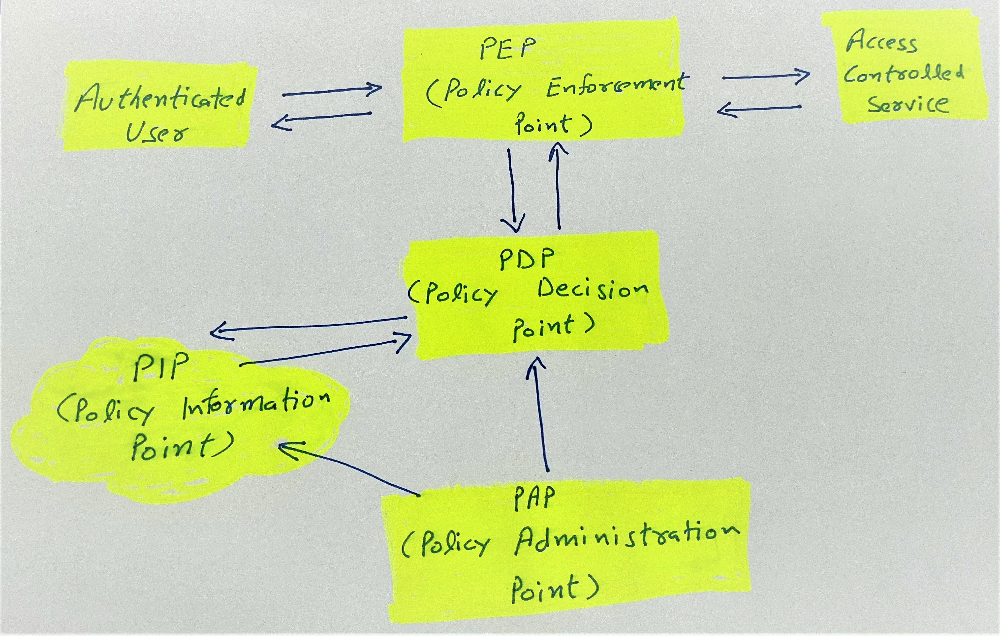

# access-control

There are numerous ways in which an application/service/organization does access control.
For example, role/group/attribute/policy based access.
The purpose of this repository is to have a running sample of how simple access decisions can be made using [PEP and PDP](https://datatracker.ietf.org/doc/html/rfc2753#section-4)

## Intended Flow

